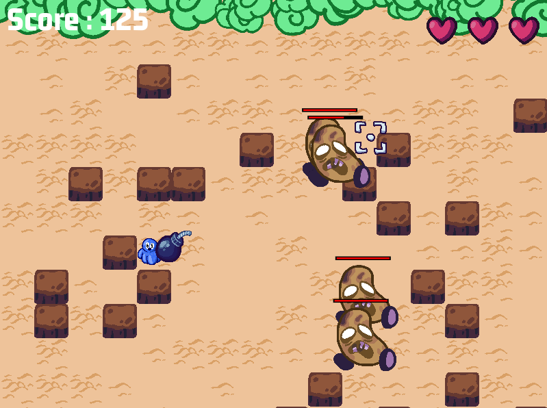

# Ludum Dare 49: Theme is "Unstable"

## Introduction
It's a game for Ludum dare 49, GameJam.

## Download

[REALEASE/DOWNLOAD](https://github.com/ARKANYOTA/ludumdare49/releases/tag/Download)
---

- linux, windows, love : works
- macos : not test, not have mac
- lovejs : dosent works on devs computers

Windows: unzip “OctoBoom-win32.zip” or “OctoBoom-win64.zip” and run “Octoboom.exe”

MacOS: (MacOS version may not work as we have not tested it)

Linux: download the .AppImage, then run: `chmod 755 ./OctoBoom.AppImage`, then run `./OctoBoom.AppImage`

Löve: Install it, then execute `love OctoBoom.love` or drop it on love executable.

## Developers

| User | Role | Github | Discord |
|------|------|--------|---------|
| ARKANYOTA | Dev & Idea | [ARKANYOTA](https://github.com/ARKANYOTA) | arkanyota#3321 |
| Yolwoocle | Dev & Idea | [Yolwoocle](https://github.com/Yolwoocle) | |
| Maxim-Costa | Dev & Idea | [Maxim-Costa](https://github.com/Maxim-Costa) | |
| Notgoyome | Dev & Idea | [Yauyau123](https://github.com/Yauyau123) | |
| Poulpito\_GDL | Images | [PoulpitoGDL](https://github.com/PoulipitoGDL) | |
| Pierre | Music | [PierreAndries](https://github.com/PIerreAndries) | |
| Antoine | Idea | [Antoine-Roucau](https://github.com/Antoine-Roucau) | |

## Game

An accident has occurred in the mine and toxic gas is escaping! Flee! Your bomb is your weapon. Throw it on enemies, and catch it before it explodes. The longer you let it fly, the more points it’ll give you, but this is at your own risk.

## Controls

### Everywhere
- Ctrl + C: Quit game except when is in error
- F3: Debug vars, maybe delete at final version
- F5: Restart windows

### In game
- w, s, a and d and arrows: Move player (Change with you keyboard layout)
- escape: Pause game
- mouse: for launch bomb

### In pause mode
- escape: exit pause menu

## Game Jam

[Link to GameJam](https://ldjam.com/events/ludum-dare/49)

